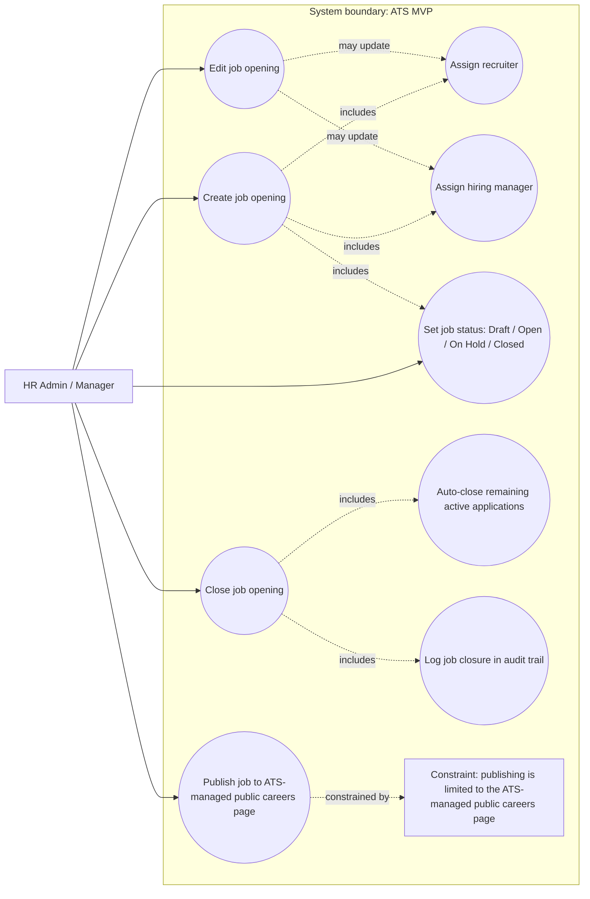
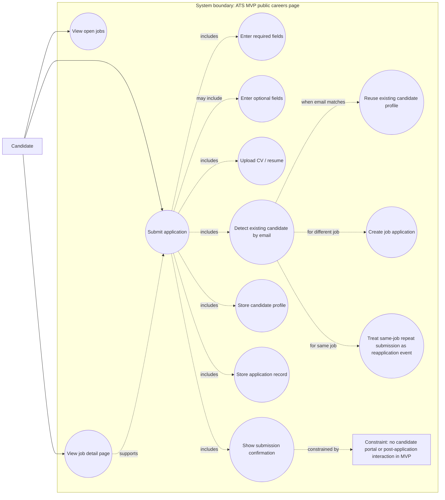
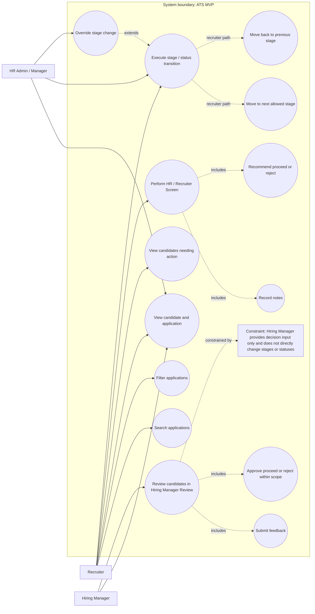

# ATS MVP Briefing

## Brief description of the software

The **ATS MVP** is a simple Applicant Tracking System designed for **small businesses** to centralize and standardize hiring. It combines an **internal web application** for company staff with an **ATS-managed public careers page** where external candidates can view open roles and submit applications. The product is intentionally narrow in scope: it focuses on covering the core hiring flow end to end without adding unnecessary complexity, heavy automation, or enterprise-style features.

## Added value

The ATS MVP creates value by giving small teams **one shared place** to manage hiring, making each candidate’s status visible and showing what needs to happen next. It helps replace fragmented hiring practices spread across email, spreadsheets, notes, and memory with a clearer, more consistent, and more structured process. This allows teams to run hiring in a way that is **clear, shared, and consistent**.

## Competitive advantages

* **Right-sized for small companies**: built for organizations with modest hiring needs, without the weight of enterprise complexity.
* **Clear visibility**: makes candidate status and next actions easy to understand at any time.
* **Clear ownership**: supports explicit responsibility across the hiring process, helping teams know who should act next.
* **Consistent hiring process**: uses one fixed pipeline and standardized handling to reduce ad hoc or inconsistent recruiting practices.
* **Simplicity by design**: intentionally excludes integrations, advanced scheduling, multi-tenant support, complex approvals, and other non-MVP features in order to stay easy to adopt and operate.

## Summary statement

The ATS MVP is a **simple, right-sized hiring system for small businesses** that delivers **centralized hiring operations, clear process visibility, and consistent execution** without unnecessary complexity. 

# ATS MVP Briefing — Main Functions

The ATS MVP is designed to manage the hiring process end to end for a small business: from creating job openings and collecting applications to tracking candidates, coordinating interviews, gathering feedback, and recording final hiring decisions.

## 1. Job management and publishing

The system allows internal users to create and manage job openings, assign key owners, and publish jobs to the **ATS-managed public careers page**. Publishing is intentionally limited to that single public careers surface; external posting channels are not part of the MVP.

## 2. Candidate application intake

Candidates can browse open jobs, view job details, and submit applications through the public apply form. The system captures core applicant data and CV/resume submission, then brings that information into the internal hiring workflow. There is no candidate portal or post-application self-service in MVP.

## 3. Candidate and application record management

The product stores **candidate profiles** separately from **job application records**. Candidate profiles hold stable person-level data, while applications hold job-specific process data such as stage, status, feedback history, assigned owners, and next action ownership. This separation keeps hiring operations structured and reduces confusion across multiple applications.

## 4. Pipeline tracking and workflow control

A core function of the ATS MVP is moving candidates through **one fixed hiring pipeline** shared across all jobs. The system tracks where each candidate is in the process, who is responsible for the next step, and what action is required next. Pipeline stages are used for active workflow steps, while final outcomes are tracked through application status.

## 5. Interview scheduling and tracking

Recruiters can create and maintain interview records inside the ATS, including interview type, date/time, interviewer, format, location or meeting link, and status. The system tracks interviews operationally, but calendar sync, automated invites, interviewer availability logic, and self-scheduling are out of scope for MVP.

## 6. Feedback and evaluation capture

The product supports structured feedback collection using a standard feedback format. Interviewers and hiring managers can record recommendations, ratings, strengths, concerns, comments, and confidence. This gives the team a consistent way to evaluate candidates across the hiring flow.

## 7. Communication logging and follow-up tracking

The ATS MVP logs hiring-related communication as an internal timeline of interactions and notes, such as emails sent, calls made, interview invites, and message notes. It also supports basic follow-up tracking. This is logging only, not outbound communication automation.

## 8. Offer and final decision handling

The system includes **basic offer management** and final hiring decision recording. Offer handling is intentionally lightweight, and final outcomes such as hired, rejected, withdrawn, or closed are recorded at the application level. Decision ownership and status recording are clearly separated in the workflow.

## 9. Operational visibility for daily hiring work

The landing view is designed to support day-to-day execution, not analytics. Its main purpose is to show which candidates need action, what the next required action is, who owns it, what interviews are coming up, which applications are recent, and which jobs are open.

## Summary

In practical terms, the main functions of the ATS MVP are to:

* manage job openings
* collect candidate applications
* maintain candidate and application records
* track candidates through a fixed hiring pipeline
* schedule and track interviews
* collect structured feedback
* log communication and follow-ups
* record offers and final decisions
* surface next actions clearly for the hiring team 

# Lean Canvas — ATS MVP

*Based on the approved ATS MVP product context in* **Context Final Reconciled.pdf**, *with revenue model clarified in this chat as a flat monthly SaaS fee.*

| **Problem**                                                                                                                                                                                                         | **Solution**                                                                                                                                                                                                                                                                   | **Unique Value Proposition**                                                                                                                                                                                  |
| ------------------------------------------------------------------------------------------------------------------------------------------------------------------------------------------------------------------- | ------------------------------------------------------------------------------------------------------------------------------------------------------------------------------------------------------------------------------------------------------------------------------ | ------------------------------------------------------------------------------------------------------------------------------------------------------------------------------------------------------------- |
| Hiring data is scattered across email, spreadsheets, notes, and memory.  Tracking is manual and inconsistent.  Status and next steps are hard to see.  Hiring is fragmented and not standardized. | One shared candidate database.  One fixed hiring pipeline.  ATS-managed public careers page.  Candidate and application records.  Interview scheduling records, feedback, communication log, follow-ups, offer tracking, and final decision recording. | **A simple, right-sized ATS for small companies that centralizes hiring, makes every candidate’s status clear, and shows what needs to happen next.**  Structured hiring without enterprise complexity. |

| **Unfair Advantage**                                                                                                                                                                                                                                        | **Customer Segments**                                                                                                                                                                                                                                                         | **Key Metrics**                                                                                                                                                                                                                                                                                                                                    |
| ----------------------------------------------------------------------------------------------------------------------------------------------------------------------------------------------------------------------------------------------------------- | ----------------------------------------------------------------------------------------------------------------------------------------------------------------------------------------------------------------------------------------------------------------------------- | -------------------------------------------------------------------------------------------------------------------------------------------------------------------------------------------------------------------------------------------------------------------------------------------------------------------------------------------------- |
| Simplicity-first design for small teams.  Clear ownership through assigned recruiter, hiring manager, and next action owner.  Strong visibility into status and next steps.  Standardized hiring flow with auditability and traceability. | Small businesses with **50–100 employees**.  Modest hiring volume: about **10–12 openings per year**.  Core internal users: HR Admin/Manager, Recruiter, Hiring Manager, Interviewer.  External candidate uses only the public careers page and apply form. | ATS becomes the default place to manage hiring.  Candidate progress and ownership are always clear.  One consistent hiring process is followed.  No parallel trackers are maintained.  The MVP covers the full hiring flow without operational gaps.  Key decisions and status changes are easy to review afterward. |

| **Channels**                                                                                              | **Cost Structure**        | **Revenue Streams**        |
| --------------------------------------------------------------------------------------------------------- | ------------------------- | -------------------------- |
| ATS-managed public careers page for applicants.  Commercial acquisition channels: **out of scope**. | **Out of scope** for now. | **Flat monthly SaaS fee**. |

# Use Cases

## 1. Create and Manage Job Openings

This use case covers how HR Admin / Manager sets up and maintains a job opening in the ATS, including creating and
editing the job, assigning the recruiter and hiring manager, managing the job status, and publishing it. In MVP,
publishing is limited to the ATS-managed public careers page, and closing a job can automatically close any remaining
active applications tied to it.

## 2. Collect Candidate Applications from the Public Careers Page

This use case covers how an external candidate browses open jobs, views a job detail page, completes the public apply
form, uploads a CV, and submits an application. The ATS stores the candidate profile and related application record,
reuses an existing candidate profile when the email already exists, and treats a repeated submission to the same job as
a reapplication event rather than creating a duplicate active application. There is no candidate portal or
post-application interaction in MVP beyond submission confirmation

## 3. Review and Screen Applications

This use case covers how internal hiring staff evaluate incoming applications within the fixed MVP hiring pipeline.
Recruiters review applications, perform the HR / Recruiter Screen, record notes, and move candidates through allowed
stages; Hiring Managers review candidates and provide decision input within their scope, but they do not directly change
stages or statuses; HR Admin / Manager retains override authority. The goal is to keep candidate status, next action,
and ownership clear throughout screening and review.

# Data Model