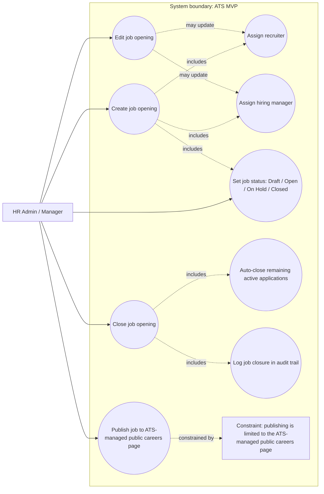
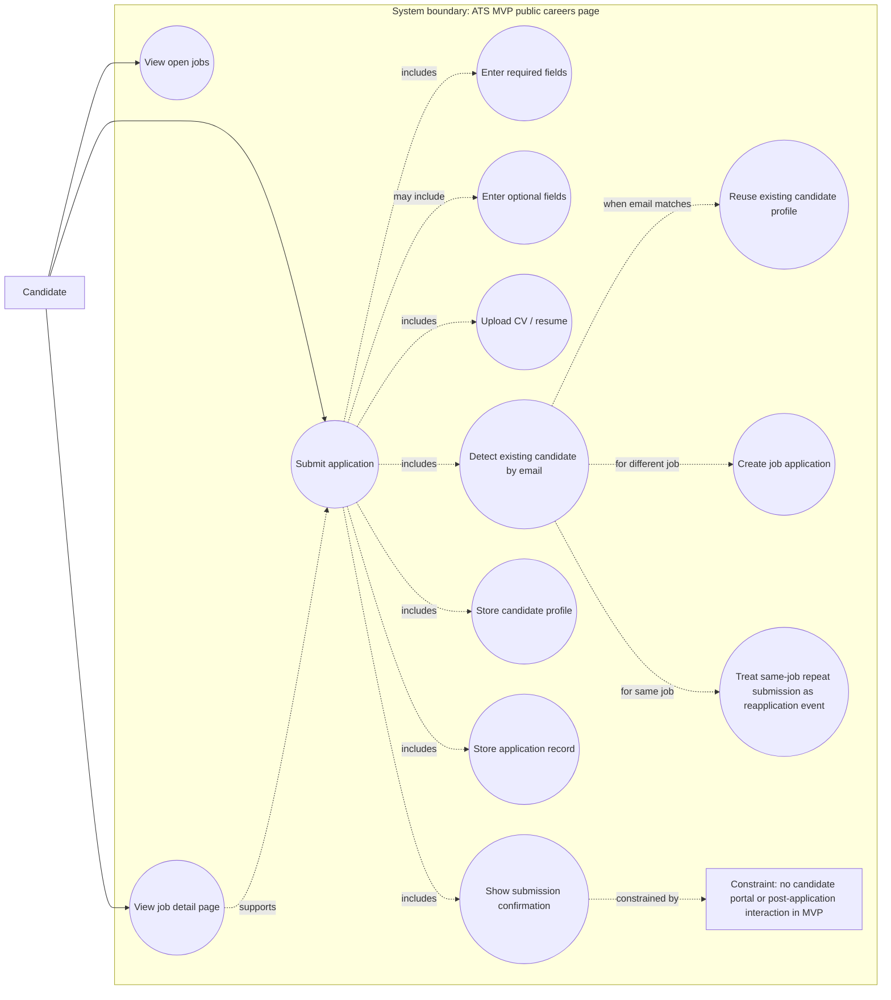
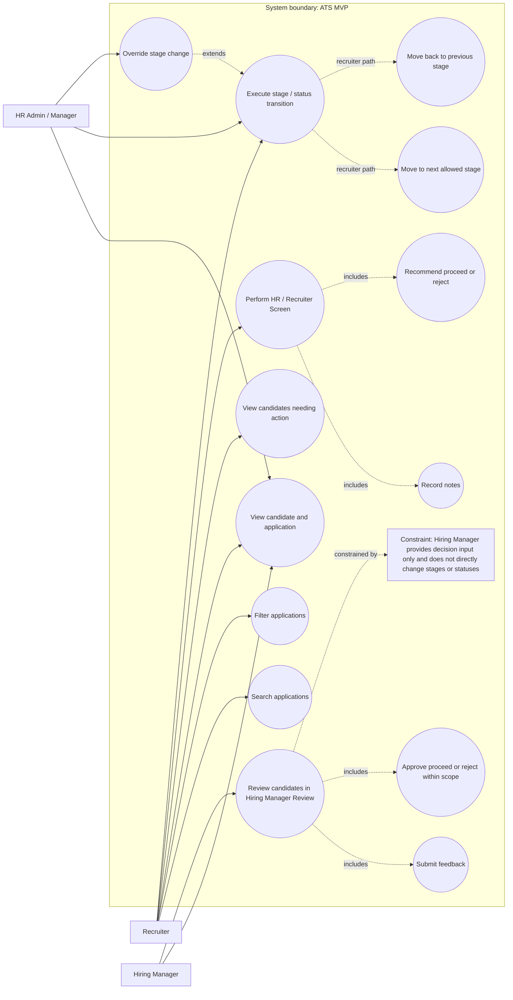
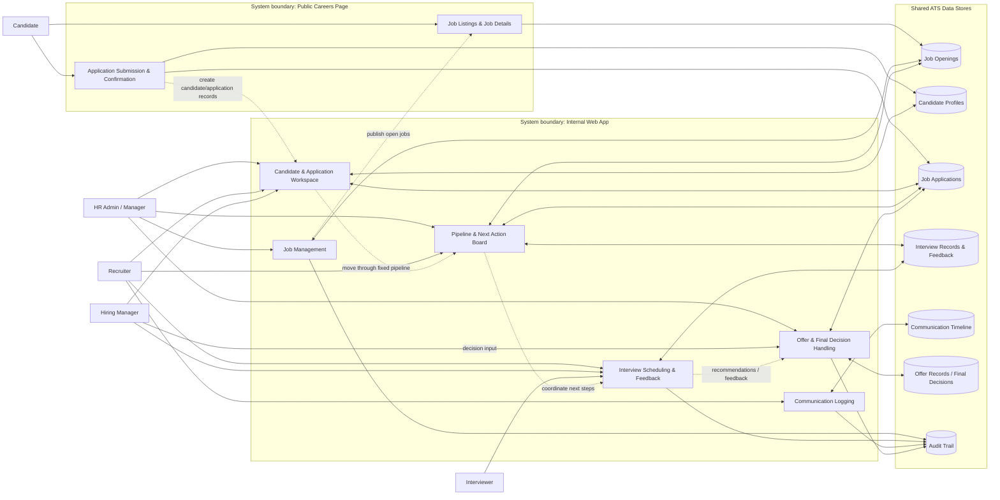

# ATS MVP Briefing

## Brief description of the software

The **ATS MVP** is a simple Applicant Tracking System designed for **small businesses** to centralize and standardize hiring. It combines an **internal web application** for company staff with an **ATS-managed public careers page** where external candidates can view open roles and submit applications. The product is intentionally narrow in scope: it focuses on covering the core hiring flow end to end without adding unnecessary complexity, heavy automation, or enterprise-style features.

## Added value

The ATS MVP creates value by giving small teams **one shared place** to manage hiring, making each candidate’s status visible and showing what needs to happen next. It helps replace fragmented hiring practices spread across email, spreadsheets, notes, and memory with a clearer, more consistent, and more structured process. This allows teams to run hiring in a way that is **clear, shared, and consistent**.

## Competitive advantages

* **Right-sized for small companies**: built for organizations with modest hiring needs, without the weight of enterprise complexity.
* **Clear visibility**: makes candidate status and next actions easy to understand at any time.
* **Clear ownership**: supports explicit responsibility across the hiring process, helping teams know who should act next.
* **Consistent hiring process**: uses one fixed pipeline and standardized handling to reduce ad hoc or inconsistent recruiting practices.
* **Simplicity by design**: intentionally excludes integrations, advanced scheduling, multi-tenant support, complex approvals, and other non-MVP features in order to stay easy to adopt and operate.

## Summary statement

The ATS MVP is a **simple, right-sized hiring system for small businesses** that delivers **centralized hiring operations, clear process visibility, and consistent execution** without unnecessary complexity. 

# ATS MVP Briefing — Main Functions

The ATS MVP is designed to manage the hiring process end to end for a small business: from creating job openings and collecting applications to tracking candidates, coordinating interviews, gathering feedback, and recording final hiring decisions.

## 1. Job management and publishing

The system allows internal users to create and manage job openings, assign key owners, and publish jobs to the **ATS-managed public careers page**. Publishing is intentionally limited to that single public careers surface; external posting channels are not part of the MVP.

## 2. Candidate application intake

Candidates can browse open jobs, view job details, and submit applications through the public apply form. The system captures core applicant data and CV/resume submission, then brings that information into the internal hiring workflow. There is no candidate portal or post-application self-service in MVP.

## 3. Candidate and application record management

The product stores **candidate profiles** separately from **job application records**. Candidate profiles hold stable person-level data, while applications hold job-specific process data such as stage, status, feedback history, assigned owners, and next action ownership. This separation keeps hiring operations structured and reduces confusion across multiple applications.

## 4. Pipeline tracking and workflow control

A core function of the ATS MVP is moving candidates through **one fixed hiring pipeline** shared across all jobs. The system tracks where each candidate is in the process, who is responsible for the next step, and what action is required next. Pipeline stages are used for active workflow steps, while final outcomes are tracked through application status.

## 5. Interview scheduling and tracking

Recruiters can create and maintain interview records inside the ATS, including interview type, date/time, interviewer, format, location or meeting link, and status. The system tracks interviews operationally, but calendar sync, automated invites, interviewer availability logic, and self-scheduling are out of scope for MVP.

## 6. Feedback and evaluation capture

The product supports structured feedback collection using a standard feedback format. Interviewers and hiring managers can record recommendations, ratings, strengths, concerns, comments, and confidence. This gives the team a consistent way to evaluate candidates across the hiring flow.

## 7. Communication logging and follow-up tracking

The ATS MVP logs hiring-related communication as an internal timeline of interactions and notes, such as emails sent, calls made, interview invites, and message notes. It also supports basic follow-up tracking. This is logging only, not outbound communication automation.

## 8. Offer and final decision handling

The system includes **basic offer management** and final hiring decision recording. Offer handling is intentionally lightweight, and final outcomes such as hired, rejected, withdrawn, or closed are recorded at the application level. Decision ownership and status recording are clearly separated in the workflow.

## 9. Operational visibility for daily hiring work

The landing view is designed to support day-to-day execution, not analytics. Its main purpose is to show which candidates need action, what the next required action is, who owns it, what interviews are coming up, which applications are recent, and which jobs are open.

## Summary

In practical terms, the main functions of the ATS MVP are to:

* manage job openings
* collect candidate applications
* maintain candidate and application records
* track candidates through a fixed hiring pipeline
* schedule and track interviews
* collect structured feedback
* log communication and follow-ups
* record offers and final decisions
* surface next actions clearly for the hiring team 

# Lean Canvas — ATS MVP

*Based on the approved ATS MVP product context in* **Context Final Reconciled.pdf**, *with revenue model clarified in this chat as a flat monthly SaaS fee.*

| **Problem**                                                                                                                                                                                                         | **Solution**                                                                                                                                                                                                                                                                   | **Unique Value Proposition**                                                                                                                                                                                  |
| ------------------------------------------------------------------------------------------------------------------------------------------------------------------------------------------------------------------- | ------------------------------------------------------------------------------------------------------------------------------------------------------------------------------------------------------------------------------------------------------------------------------ | ------------------------------------------------------------------------------------------------------------------------------------------------------------------------------------------------------------- |
| Hiring data is scattered across email, spreadsheets, notes, and memory.  Tracking is manual and inconsistent.  Status and next steps are hard to see.  Hiring is fragmented and not standardized. | One shared candidate database.  One fixed hiring pipeline.  ATS-managed public careers page.  Candidate and application records.  Interview scheduling records, feedback, communication log, follow-ups, offer tracking, and final decision recording. | **A simple, right-sized ATS for small companies that centralizes hiring, makes every candidate’s status clear, and shows what needs to happen next.**  Structured hiring without enterprise complexity. |

| **Unfair Advantage**                                                                                                                                                                                                                                        | **Customer Segments**                                                                                                                                                                                                                                                         | **Key Metrics**                                                                                                                                                                                                                                                                                                                                    |
| ----------------------------------------------------------------------------------------------------------------------------------------------------------------------------------------------------------------------------------------------------------- | ----------------------------------------------------------------------------------------------------------------------------------------------------------------------------------------------------------------------------------------------------------------------------- | -------------------------------------------------------------------------------------------------------------------------------------------------------------------------------------------------------------------------------------------------------------------------------------------------------------------------------------------------- |
| Simplicity-first design for small teams.  Clear ownership through assigned recruiter, hiring manager, and next action owner.  Strong visibility into status and next steps.  Standardized hiring flow with auditability and traceability. | Small businesses with **50–100 employees**.  Modest hiring volume: about **10–12 openings per year**.  Core internal users: HR Admin/Manager, Recruiter, Hiring Manager, Interviewer.  External candidate uses only the public careers page and apply form. | ATS becomes the default place to manage hiring.  Candidate progress and ownership are always clear.  One consistent hiring process is followed.  No parallel trackers are maintained.  The MVP covers the full hiring flow without operational gaps.  Key decisions and status changes are easy to review afterward. |

| **Channels**                                                                                              | **Cost Structure**        | **Revenue Streams**        |
| --------------------------------------------------------------------------------------------------------- | ------------------------- | -------------------------- |
| ATS-managed public careers page for applicants.  Commercial acquisition channels: **out of scope**. | **Out of scope** for now. | **Flat monthly SaaS fee**. |

# Use Cases

## 1. Create and Manage Job Openings

This use case covers how HR Admin / Manager sets up and maintains a job opening in the ATS, including creating and
editing the job, assigning the recruiter and hiring manager, managing the job status, and publishing it. In MVP,
publishing is limited to the ATS-managed public careers page, and closing a job can automatically close any remaining
active applications tied to it.

## 2. Collect Candidate Applications from the Public Careers Page

This use case covers how an external candidate browses open jobs, views a job detail page, completes the public apply
form, uploads a CV, and submits an application. The ATS stores the candidate profile and related application record,
reuses an existing candidate profile when the email already exists, and treats a repeated submission to the same job as
a reapplication event rather than creating a duplicate active application. There is no candidate portal or
post-application interaction in MVP beyond submission confirmation

## 3. Review and Screen Applications

This use case covers how internal hiring staff evaluate incoming applications within the fixed MVP hiring pipeline.
Recruiters review applications, perform the HR / Recruiter Screen, record notes, and move candidates through allowed
stages; Hiring Managers review candidates and provide decision input within their scope, but they do not directly change
stages or statuses; HR Admin / Manager retains override authority. The goal is to keep candidate status, next action,
and ownership clear throughout screening and review.

# Data Model

erDiagram
STAFF_USER {
string staff_user_id PK
string full_name
enum role
}

    CANDIDATE_PROFILE {
        string candidate_id PK
        string full_name
        string email UK
        string phone
        string current_location
        string linkedin_profile
        string portfolio_website
        file cv_resume_file
        string expected_salary
        string notice_period_availability
        text tags_labels
        text general_notes
    }

    JOB_OPENING {
        string job_opening_id PK
        string job_title
        string seniority_level
        string department_team
        reference hiring_manager_id FK
        reference assigned_recruiter_id FK
        string employment_type
        string location
        text job_description
        text required_skills
        enum job_status
        integer number_of_openings
        date target_hire_date
        string salary_range
        string closing_reason
    }

    JOB_APPLICATION {
        string application_id PK
        reference candidate_id FK
        reference job_opening_id FK
        string source_of_application
        date application_date
        enum current_stage
        enum application_status
        reference assigned_recruiter_id FK
        reference assigned_hiring_manager_id FK
        date last_stage_update_date
        string next_action
        reference next_action_owner_id FK
        string rejection_reason
        string withdrawal_reason
        string closure_reason
        date decision_date
        text final_note
        reference decision_maker_id FK
    }

    OFFER {
        string offer_id PK
        reference application_id FK
        enum offer_status
        date extended_date
        date response_date
    }

    INTERVIEW_RECORD {
        string interview_record_id PK
        reference candidate_id FK
        reference application_id FK
        enum interview_step
        datetime interview_datetime
        reference interviewer_id FK
        enum interview_format
        string location_meeting_link
        enum interview_status
        text notes
    }

    FEEDBACK {
        string feedback_id PK
        reference application_id FK
        reference interview_record_id FK
        reference author_id FK
        enum feedback_stage
        enum overall_recommendation
        integer role_fit_rating
        string strengths
        string concerns
        text comments
        enum confidence_level
        datetime submitted_at
    }

    COMMUNICATION_ENTRY {
        string communication_entry_id PK
        reference application_id FK
        reference author_id FK
        date entry_date
        enum communication_type
        string short_summary
        boolean next_follow_up_needed
        date follow_up_date
    }

    AUDIT_TRAIL_ENTRY {
        string audit_trail_entry_id PK
        string entity_changed
        reference entity_record_id
        string action_type
        reference actor_id FK
        datetime timestamp
        text change_summary
    }

    STAFF_USER ||--o{ JOB_OPENING : hiring_manager
    STAFF_USER ||--o{ JOB_OPENING : assigned_recruiter

    CANDIDATE_PROFILE ||--o{ JOB_APPLICATION : submits
    JOB_OPENING ||--o{ JOB_APPLICATION : receives
    STAFF_USER ||--o{ JOB_APPLICATION : assigned_recruiter
    STAFF_USER ||--o{ JOB_APPLICATION : assigned_hiring_manager
    STAFF_USER ||--o{ JOB_APPLICATION : next_action_owner
    STAFF_USER ||--o{ JOB_APPLICATION : decision_maker

    JOB_APPLICATION ||--o| OFFER : has

    CANDIDATE_PROFILE ||--o{ INTERVIEW_RECORD : attends
    JOB_APPLICATION ||--o{ INTERVIEW_RECORD : includes
    STAFF_USER ||--o{ INTERVIEW_RECORD : interviewer

    JOB_APPLICATION ||--o{ FEEDBACK : collects
    INTERVIEW_RECORD o|--o{ FEEDBACK : contextualizes
    STAFF_USER ||--o{ FEEDBACK : authors

    JOB_APPLICATION ||--o{ COMMUNICATION_ENTRY : logs
    STAFF_USER ||--o{ COMMUNICATION_ENTRY : authors

    STAFF_USER ||--o{ AUDIT_TRAIL_ENTRY : actor

## ATS MVP High-Level System Design

The ATS MVP has two system surfaces only: an **internal web app** for company staff and an **ATS-managed public careers page** for external candidates. The public surface is intentionally narrow: it supports open-job discovery, job details, application submission, and submission confirmation only. The internal surface is centered on six major modules: **Job Management**, **Candidate & Application Workspace**, **Pipeline & Next Action Board**, **Interview Scheduling & Feedback**, **Communication Logging**, and **Offer & Final Decision Handling**. This aligns with the approved MVP scope and excludes integrations, advanced scheduling, analytics, candidate portal features, and user administration.

The shared data layer is organized around the core records defined in the sources: **Job Openings**, **Candidate Profiles**, **Job Applications**, **Interview Records & Feedback**, **Communication Timeline**, **Offer Records / Final Decisions**, and **Audit Trail**. Access is role- and scope-based: **HR Admin / Manager** has full coverage, **Recruiter** operates assigned jobs and applications, **Hiring Manager** provides review and decision input within owned jobs, **Interviewer** works only on assigned interviews, and **Candidate** interacts only with the public careers page.

flowchart LR
%% Actors
C[Candidate]
HR[HR Admin / Manager]
R[Recruiter]
HM[Hiring Manager]
IV[Interviewer]

    %% Public surface
    subgraph P["System boundary: Public Careers Page"]
        P1[Job Listings & Job Details]
        P2[Application Submission & Confirmation]
    end

    %% Internal surface
    subgraph I["System boundary: Internal Web App"]
        I1[Job Management]
        I2[Candidate & Application Workspace]
        I3[Pipeline & Next Action Board]
        I4[Interview Scheduling & Feedback]
        I5[Communication Logging]
        I6[Offer & Final Decision Handling]
    end

    %% Data stores
    subgraph D["Shared ATS Data Stores"]
        D1[(Job Openings)]
        D2[(Candidate Profiles)]
        D3[(Job Applications)]
        D4[(Interview Records & Feedback)]
        D5[(Communication Timeline)]
        D6[(Offer Records / Final Decisions)]
        D7[(Audit Trail)]
    end

    %% Actor access mapping
    C --> P1
    C --> P2

    HR --> I1
    HR --> I2
    HR --> I3
    HR --> I6

    R --> I2
    R --> I3
    R --> I4
    R --> I5

    HM --> I2
    HM --> I4
    HM -- decision input --> I6

    IV --> I4

    %% Core workflow paths
    I1 -. publish open jobs .-> P1
    P2 -. create candidate/application records .-> I2
    I2 -. move through fixed pipeline .-> I3
    I3 -. coordinate next steps .-> I4
    I4 -. recommendations / feedback .-> I6

    %% Module to store mapping
    P1 --> D1
    P2 --> D2
    P2 --> D3

    I1 <--> D1
    I1 --> D7

    I2 <--> D2
    I2 <--> D3

    I3 <--> D1
    I3 <--> D3
    I3 <--> D4

    I4 <--> D4
    I4 --> D7

    I5 <--> D5
    I5 --> D7

    I6 <--> D3
    I6 <--> D6
    I6 --> D7

# C4 Diagram 

C4Container
title ATS MVP - Hiring Pipeline and Stage Tracking

Person(recruiter, "Recruiter", "Reviews applications, moves candidates through allowed stage transitions, schedules interviews, and records notes.")
Person(hiring_manager, "Hiring Manager", "Reviews candidates and provides decision input within owned jobs. Does not directly change stages or statuses.")
Person(hr_admin, "HR Admin / Manager", "Has full access to jobs and applications. Records final status and can override stage changes.")
Person(interviewer, "Interviewer", "Accesses assigned interviews only, sees candidate CV and relevant notes, and submits feedback.")

System_Boundary(ats, "ATS MVP - Internal System") {
Container_Boundary(workflow, "Hiring Pipeline Operations Boundary") {
Container(internal_web, "ATS Internal Web App", "Web application", "Internal workspace for application review, stage tracking, interview tracking, feedback, communication logging, and closure handling.")
Container(pipeline_service, "Pipeline and Stage Tracking Service", "Application service", "Enforces one fixed pipeline: Applied, HR / Recruiter Screen, Hiring Manager Review, Interview, Offer. Manages current stage, application status, next action owner, and shared notes.")
Container(interview_service, "Interview Tracking and Feedback Service", "Application service", "Creates interview records inside the Interview stage and stores structured feedback and recommendations.")
Container(comm_service, "Communication and Follow-up Service", "Application service", "Stores communication log entries and follow-up tracking for each application.")
Container(decision_service, "Decision and Closure Service", "Application service", "Records final hiring decisions, closure reasons, decision date, final note, and offer-related outcome handling.")
}

    Container_Boundary(control, "Role and Scope Control Boundary") {
        Container(access_control, "Access and Scope Control", "Application service", "Enforces role-based permissions and scope-based visibility for jobs, applications, interviews, notes, and feedback.")
        Container(audit_service, "Audit Trail Service", "Application service", "Records workflow-critical system and data changes for traceability.")
    }

    ContainerDb(hiring_store, "Hiring Operations Store", "Relational data store", "Stores jobs, candidates, applications, current stage, application status, next action owner, shared notes, interviews, feedback, communication entries, follow-up data, and offer data.")
    ContainerDb(audit_store, "Audit Trail Store", "Append-only data store", "Stores entity changed, action type, actor, timestamp, and change summary.")
}

Rel(recruiter, internal_web, "Reviews applications and moves candidates through allowed stages")
Rel(hiring_manager, internal_web, "Reviews candidates and provides proceed, reject, or hire input only")
Rel(hr_admin, internal_web, "Views all jobs and applications, records final status, and overrides stage changes")
Rel(interviewer, internal_web, "Views assigned interviews only and submits feedback")

Rel(internal_web, access_control, "Authorizes actions by role and scope")
Rel(internal_web, pipeline_service, "Reads and updates stage, status, next action owner, and notes")
Rel(internal_web, interview_service, "Creates interview records and submits feedback")
Rel(internal_web, comm_service, "Logs communication entries and follow-up tracking")
Rel(internal_web, decision_service, "Records final decisions and closure handling")

Rel(pipeline_service, access_control, "Validates allowed stage transitions and scope")
Rel(interview_service, access_control, "Validates interview and candidate-context visibility")
Rel(decision_service, access_control, "Validates decision authority and override rights")

Rel(pipeline_service, hiring_store, "Stores pipeline stage, application status, next action owner, and notes")
Rel(interview_service, hiring_store, "Stores interview records and feedback history")
Rel(comm_service, hiring_store, "Stores communication log and follow-up data")
Rel(decision_service, hiring_store, "Stores final status and closure data")
Rel(access_control, hiring_store, "Reads job and application scope context")

Rel(pipeline_service, audit_service, "Logs stage and status changes")
Rel(interview_service, audit_service, "Logs interview and feedback changes")
Rel(comm_service, audit_service, "Logs follow-up changes")
Rel(decision_service, audit_service, "Logs decision and closure changes")
Rel(audit_service, audit_store, "Stores audit entries")